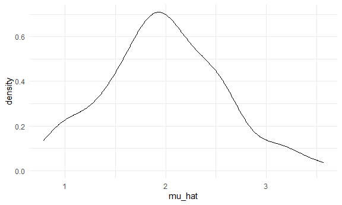
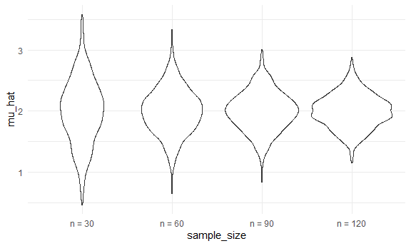
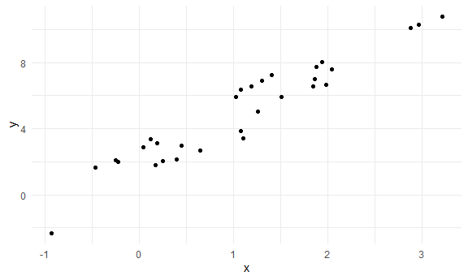
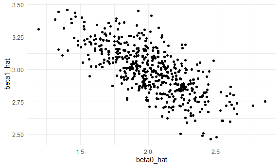
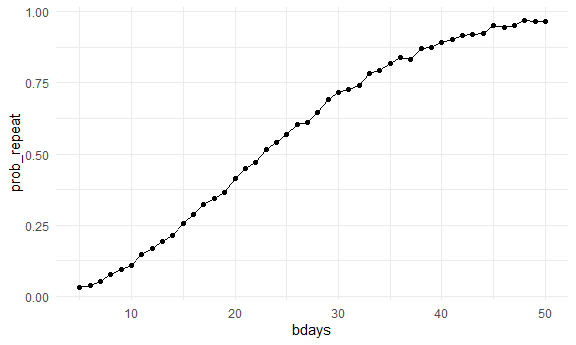

simulation
================
Casandra Laney
2025-10-30

``` r
library(tidyverse)
```

    ## ── Attaching core tidyverse packages ──────────────────────── tidyverse 2.0.0 ──
    ## ✔ dplyr     1.1.4     ✔ readr     2.1.5
    ## ✔ forcats   1.0.0     ✔ stringr   1.5.1
    ## ✔ ggplot2   3.5.2     ✔ tibble    3.3.0
    ## ✔ lubridate 1.9.4     ✔ tidyr     1.3.1
    ## ✔ purrr     1.1.0     
    ## ── Conflicts ────────────────────────────────────────── tidyverse_conflicts() ──
    ## ✖ dplyr::filter() masks stats::filter()
    ## ✖ dplyr::lag()    masks stats::lag()
    ## ℹ Use the conflicted package (<http://conflicted.r-lib.org/>) to force all conflicts to become errors

``` r
knitr::opts_chunk$set(
  fig.width = 6,
  fig.asp = .6,
  out.width = "90%"
)

theme_set(theme_minimal() + theme(legend.position = "bottom"))

options(
  ggplot2.continuous.colour = "viridis",
  ggplot2.continuous.fill = "viridis"
)

scale_colour_discrete = scale_colour_viridis_d
scale_fill_discrete = scale_fill_viridis_d

source("source/sim_mean_sd.R")
```

We can ‘simulate’ by running our function

``` r
sim_mean_sd(n = 30)
```

    ## # A tibble: 1 × 2
    ##   mu_hat sigma_hat
    ##    <dbl>     <dbl>
    ## 1   2.73      3.75

Can I ‘verify’ the CLT?

First with a ‘for loop’

``` r
output = vector("list", length = 100)

for (i in 1:100) {
  
  output[[i]] = sim_mean_sd(30)
  
}

output |>
  bind_rows() |>
  ggplot(aes(x = mu_hat)) +
  geom_density()
```



Try to repeat with a map statement

``` r
sim_results_df =
  expand_grid(
    iter = 1:1000,
    sample_size = c(30, 60, 90, 120)
  ) |>
  mutate(
    results = map(sample_size, sim_mean_sd)
  ) |>
  unnest(results)
```

Let’s look at this:

``` r
sim_results_df |>
  mutate(
    sample_size = str_c("n = ", sample_size),
    sample_size = fct_inorder(sample_size)
  ) |>
  ggplot(aes(x = sample_size, y = mu_hat)) +
  geom_violin()
```



Let’s try to summarize…

``` r
sim_results_df |> 
  group_by(sample_size) |>
  summarize(
    emp_mean = mean(mu_hat),
    emp_se = sd(mu_hat))
```

    ## # A tibble: 4 × 3
    ##   sample_size emp_mean emp_se
    ##         <dbl>    <dbl>  <dbl>
    ## 1          30     1.99  0.536
    ## 2          60     2.00  0.377
    ## 3          90     2.00  0.323
    ## 4         120     2.00  0.278

## Sample Linear Regression

``` r
sim_df = 
  tibble(
    x = rnorm(30, mean = 1, sd = 1),
    y = 2 + 3 * x + rnorm(30, 0, 1)
  )

sim_df |>
  ggplot(aes(x = x, y = y)) +
  geom_point()
```



``` r
slr_fit = lm(y ~ x, data = sim_df)

coef(slr_fit)
```

    ## (Intercept)           x 
    ##    2.040959    2.787270

``` r
sim_regression = function(n, beta0 = 2, beta1 = 3) {
  
  sim_data = 
    tibble(
      x = rnorm(n, mean = 1, sd = 1),
      y = beta0 + beta1 * x + rnorm(n, 0, 1)
    )
  
  ls_fit = lm(y ~ x, data = sim_data)
  
  tibble(
    beta0_hat = coef(ls_fit)[1],
    beta1_hat = coef(ls_fit)[2]
  )
}
```

``` r
sim_regression(n = 30)
```

    ## # A tibble: 1 × 2
    ##   beta0_hat beta1_hat
    ##       <dbl>     <dbl>
    ## 1      2.17      3.08

``` r
output = vector("list", length  = 500)

for (i in 1:500) {
  
  output[[i]] = sim_regression(n = 30)
}

output |>
  bind_rows()
```

    ## # A tibble: 500 × 2
    ##    beta0_hat beta1_hat
    ##        <dbl>     <dbl>
    ##  1      2.37      2.90
    ##  2      2.39      2.98
    ##  3      1.95      3.10
    ##  4      2.02      3.05
    ##  5      1.90      2.95
    ##  6      1.69      3.06
    ##  7      2.41      2.88
    ##  8      2.06      2.68
    ##  9      1.92      3.14
    ## 10      1.90      3.02
    ## # ℹ 490 more rows

``` r
slr_sim_results_df =
  expand_grid(
    sample_size = 30,
    iter = 1:500
  ) |>
  mutate(
    results = map(sample_size, sim_regression)
  ) |>
  unnest(results)

slr_sim_results_df |>
  ggplot(aes(x = beta0_hat, y = beta1_hat)) +
  geom_point()
```



\#One more example ie problem 1

``` r
birthdays = sample(1:365, 25, replace = TRUE)

repeated_bday = length(unique(birthdays)) < 25

repeated_bday
```

    ## [1] FALSE

put this in a function

``` r
bday_sim = function(n_room) {
  
  birthdays = sample(1:365, n_room, replace = TRUE)

  repeated_bday = length(unique(birthdays)) < n_room

  repeated_bday
}


bday_sim(5)
```

    ## [1] FALSE

``` r
bday_sim_results =
  expand_grid(
    bdays = 5:50,
    iter = 1:2500
  ) |>
  mutate(
    result = map_lgl(bdays, bday_sim)
  ) |>
  group_by(
    bdays
  ) |>
  summarize(
    prob_repeat = mean(result)
  )
```

plot this

``` r
bday_sim_results |>
  ggplot(aes(x = bdays, y = prob_repeat)) +
  geom_point() +
  geom_line()
```


